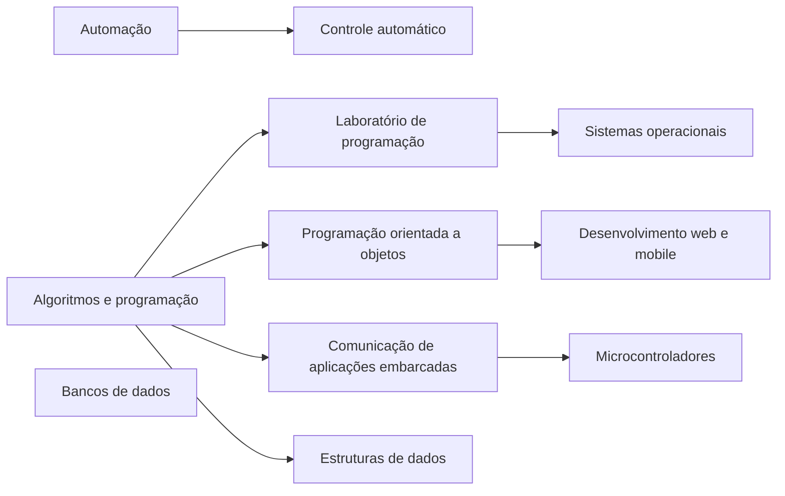

# Estrutura do curso

```mermaid
graph LR
    algo[Algoritmos e programação]
    auto[Automação]
    bcdd[Bancos de dados]
    ctrl[Controle automático]
    lprg[Laboratório de programação]
    micr[Microcontroladores]
    pobj[Programação orientada a objetos]
    cdae[Comunicação de aplicações embarcadas]
    siop[Sistemas operacionais]
    dvwm[Desenvolvimento web e mobile]
    esdd[Estruturas de dados]

    algo --> lprg
    algo --> pobj
    pobj --> dvwm
    algo --> esdd
    auto --> ctrl
    lprg --> siop
    cdae --> micr
    algo --> cdae
```
